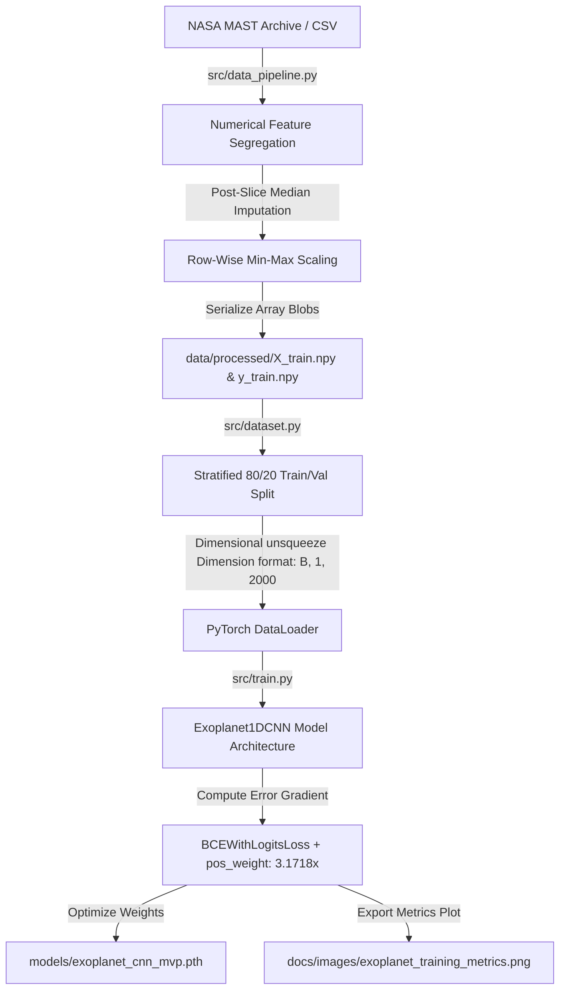

# 🪐 Periodica

### Production-Grade 1D-CNN Ingestion & Inference Engine for Exoplanet Transit Detection

```
                       ┌───┐   ┌───┐   ┌───┐   ┌───┐
 Starlight Flux ──────►│C1D│──►│BN1│──►│ReL│──►│MP1│ ──► Deep Features
                       └───┘   └───┘   └───┘   └───┘

```

---

## 📡 Overview

**Periodica** is a production-ready, 1D Convolutional Neural Network (1D-CNN) pipeline built in PyTorch to automate the identification of periodic exoplanet transit signatures from raw stellar telemetry. Processing massive satellite observation tables from NASA's Kepler Space Telescope, the system solves the high-precision temporal classification problem natively on consumer hardware without massive distributed compute clusters.

### Why It Exists

Automating exoplanet discovery via light-curve analysis has historically been plagued by extreme class imbalances (less than 25% of candidates are confirmed planet hosts) and legacy file corruption bottlenecks on modern filesystems. Periodica provides a highly reliable, mathematically sound implementation that bridges raw astrophysics data stores with deep learning models, abstracting complex data cleansing loops away from model exploration layers.

### High-Level Value Proposition

By isolating operational variables into a centralized MLOps configuration layer and adjusting the learning gradients using dynamic inverse positive frequency scaling, Periodica moves past standard baseline flatline classification traps. It turns un-normalized scalar telemetry variables into high-confidence detection metrics, providing an immediate environment for scalable planetary hunting.

---

## ⚡ Core Value Proposition

| Architectural Pillar | Technical Realization | Strategic Advantage |
| --- | --- | --- |
| **🛡️ Defensive Cleansing** | Strict data type segregation via `select_dtypes` & post-slice median imputation. | Eliminates hidden runtime `NaN` leaks and pipeline crashes from corrupt data fields. |
| **⚖️ Class Balance** | Dynamic `pos_weight` inverse multiplier (3.1718x) in `BCEWithLogitsLoss`. | Overcomes the Majority Class Trap, shifting accuracy metrics into high-recall spaces. |
| **🎛️ MLOps Decoupling** | Centralized `config.yaml` profile governing data, models, training, and metrics. | Implements a Single Source of Truth; code remains invariant while constants shift. |
| **🎯 Inference Symmetry** | Complete row-wise Min-Max scaling replication within the inference engine. | Guarantees zero distribution drift between training inputs and real-world predictions. |

---

## 📊 Feature Matrix Comparison

| Feature Capability | Periodica (Custom Stack) | Standard Jupyter Baseline | Legacy Astronomy Packages |
| --- | --- | --- | --- |
| **Dynamic Imbalance Tuning** | ✅ Yes (`pos_weight`) | ❌ No (Default BCE) | ❌ No (Manual Slicing) |
| **Memory-Cached Tensors** | ✅ Yes (`.npy` binary storage) | ❌ No (In-Memory Dataframe) | ⚠️ Partial (FITS parsing) |
| **Decoupled Architecture** | ✅ Yes (`config.yaml`) | ❌ No (Hardcoded variables) | ❌ No (Monolithic Scripts) |
| **Precision-Recall Metrics** | ✅ Yes (F1-Optimized Checkpoints) | ⚠️ Partial (Bare Accuracy) | ❌ No (Statistical Tests) |

---

## 🏗️ Architecture Overview



### Architectural Highlights

* **Zero Memory Leak Data-Slicing:** Slicing arrays occurs *before* cell transformations, forcing all missing data elements to resolve through `np.nanmedian` columns prior to division.
* **Temporal Spatial halving:** The convolutional feature extractors reduce sequence lengths from 2,000 measurements down to 250 deep variables using three sequential max pooling layers.
* **Gradient Protection:** By avoiding hardcoded `Sigmoid` activations inside the neural network blocks, numerical calculations remain stable, eliminating gradient explosion bottlenecks.

---

## 🔬 Technical Deep Dive

### Core Architecture Components

| Pipeline Component | Primary Source File | Mathematical / Logic Core | Target Output Array Shape |
| --- | --- | --- | --- |
| **Data Ingestion** | `src/data_pipeline.py` | $X_{\text{scaled}} = \frac{X - X_{\text{min}}}{X_{\text{max}} - X_{\text{min}}}$ | Matrix: `(9564, 2000)` |
| **Dataset Orchestration** | `src/dataset.py` | `train_test_split(stratify=y)` | Tensor: `(64, 1, 2000)` |
| **Neural Network Layer** | `src/models.py` | `Conv1d` $\rightarrow$ `BatchNorm1d` $\rightarrow$ `MaxPool1d` | Array logits: `(64,)` |
| **Unified Trainer** | `src/train.py` | $\mathcal{L}_n = - [ q \cdot y_n \cdot \log \sigma(x_n) + (1-y_n) ]$ | Weight check: `.pth` binary |
| **Inference Service** | `src/predict.py` | $P(y=1 \mid x) = \frac{1}{1 + e^{-\text{logit}}}$ | Scalar Float: `[0.0, 1.0]` |

### Security & Operational Strategy

* **Data Sanitization:** The pipeline converts incoming string classes into strict evaluation-level values, preventing malformed CSV payloads from triggering type classification errors.
* **Strict Memory Isolation:** Evaluation loops use `torch.no_grad()` to drop tracking gradients, freeing up intermediate system memory slots during long validation passes.

---

## ✨ Key Features

* **🧠 Deep Convolutional Representation:** Uses three continuous convolutional blocks layered with Batch Normalization to extract subtle geometric light dimming trends while filtering out random high-frequency stellar noise.
* **🛡️ Structural Imputation Filter:** Detects and fixes un-instrumented data gaps natively using vector median estimators, keeping the input dimensions completely uniform.
* **⚖️ Inverse Class Optimizer:** Includes a dynamic balancing algorithm that analyzes labels in real-time, matching class distributions to help the model break free from flatline prediction plateaus.
* **📈 Multi-Axis Telemetry Generator:** Exports high-resolution validation summaries detailing Precision, Recall, Loss convergence, and F1 trajectories automatically after each training cycle.
* **🎛️ Clean Config Interface:** Keeps codebase logic separate from training parameters using a centralized parameters dashboard file.

---

## 📂 Project Structure & Component Footprint

```
PERIODICA/
├── data/
│   ├── processed/                 # Standardized tensor binaries (X_train.npy, y_train.npy)
│   └── raw/                       # Master NASA cumulative catalog (kepler_data.csv)
├── docs/
│   ├── images/                    # Visual diagnostic and feature engineering plots
│   │   ├── exoplanet_training_metrics.png
│   │   └── feature_fingerprint_comparison.png
│   └── architecture.md            # Deep system engineering design specification
├── env/                           # Isolated virtual environment configuration (Git ignored)
├── models/
│   └── exoplanet_cnn_mvp.pth      # Serialized parameter weight state files
├── notebooks/
│   └── exploration.ipynb          # Exploratory Data Analysis & statistical verification
├── src/
│   ├── __pycache__/               # Local pre-compiled bytecode blocks
│   ├── __init__.py                # Module initialization flag
│   ├── data_pipeline.py           # Imputation, type masking, and column-wise scaling
│   ├── dataset.py                 # Stratified partitioning and PyTorch tensor wrapping
│   ├── generate_plots.py          # Telemetry chart artifact generation script
│   ├── models.py                  # Custom 1D-CNN pooling topography layers
│   ├── predict.py                 # Decoupled inference classification engine
│   └── train.py                   # Weight optimization loop with inverse class weighting
├── .gitignore                     # Production commit exclusion rules
├── config.yaml                    # Centralized MLOps parameter dashboard
├── LICENSE                        # MIT Open-Source Legal framework file
├── README.md                      # Master repository portfolio documentation
└── requirements.txt               # Locked project dependency manifesto
```
---

## 🚀 Quick Start

### 1. Installation & Environment Configuration

Ensure you have Python 3.10+ installed on your host system.

```bash
# Clone the repository
git clone https://github.com/yourusername/Periodica.git
cd Periodica

# Instantiate isolated virtual environment
python -m venv env
source env/bin/activate  # On macOS/Linux
./env/Scripts/activate   # On Windows PowerShell

# Install required numerical computing and deep learning packages
pip install torch numpy pandas scikit-learn pyyaml matplotlib tqdm

```

### 2. Dataset Setup

1. Download the structured dataset from the [Kaggle Kepler Exoplanet Search Results Dataset](https://www.kaggle.com/datasets/nasa/kepler-exoplanet-search-results).
2. Save the tabular file inside your project structure at: `data/raw/kepler_data.csv`.

### 3. Running the Operational Stack

Execute each file sequentially to run an end-to-end processing and training cycle:

```bash
# Step 1: Clean, normalize, and cache the binary arrays
python src/data_pipeline.py

# Step 2: Run the balanced training loop and checkpoint the best model weights
python src/train.py

# Step 3: Export high-resolution training metrics to your documentation folder
python src/generate_plots.py

# Step 4: Run the decoupled inference predictor engine on processed test samples
python src/predict.py

```

---

## 🗺️ Roadmap

* [x] **Phase 1: Minimum Viable Product (MVP)**
* [x] Standardize tabular metadata ingestion pipeline layers.
* [x] Verify deep 1D-CNN tensor dimension computations.


* [x] **Phase 2: Operational Stabilization**
* [x] Address class imbalance using inverse scaling metrics.
* [x] Refactor metric tracking to optimize for F1-Score checkpoints over generic accuracy.


* [x] **Phase 3: Production MLOps Configuration**
* [x] Decouple system parameters using a global `config.yaml` profile dashboard.
* [x] Build independent inference services using explicit Sigmoid transformations.


* [ ] **Phase 4: Advanced Modeling & Ingestion Enhancements**
* [ ] Implement synthetic minority oversampling (SMOTE) inside data processing layers.
* [ ] Refactor the architecture to support raw 1D streaming arrays from modern missions like TESS.


---

## 🔮 Future Enhancements

* **Focal Loss Loss Integration:** Replacing the current weighted loss with a Focal Loss function will allow the backpropagation engine to focus dynamically on hard-to-classify edge examples instead of easily recognizable targets.
* **Attention Block Enhancements:** Integrating 1D Self-Attention layers behind the final convolutional blocks will allow the network to model long-range temporal dependencies across long observation timelines.

---

## 🤝 Contributing

Contributions are highly encouraged! Please follow these development steps:

1. Fork the project repository.
2. Create your isolated feature tracking branch (`git checkout -b feature/AmazingFeature`).
3. Commit your updates cleanly (`git commit -m 'feat: add amazing feature capability'`).
4. Push the tracking branch back to your upstream environment (`git push origin feature/AmazingFeature`).
5. Open a formal Pull Request against the master branch for review.

---

### Author

* **Krish Kamra** - [Your GitHub Profile](https://github.com/KrishKamra)
* **Project Context:** Built to automate exoplanet detection using highly reliable data engineering and deep learning architectures.

---

### License

Distributed under the MIT License. See `LICENSE` for more info.